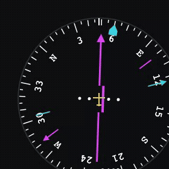
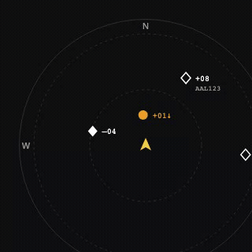
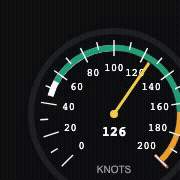
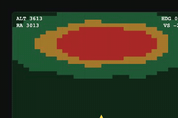
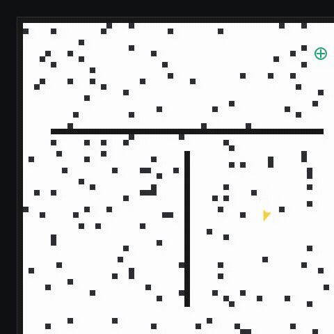
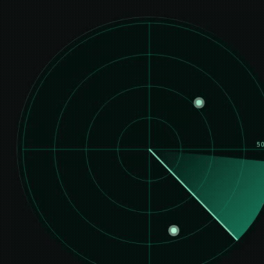
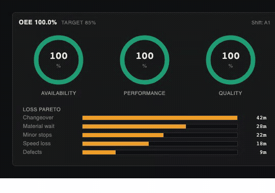
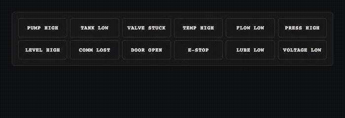

# Altara

**React components for real-time telemetry dashboards.** Built for robotics, aerospace, and industrial IoT — embed canvas-rendered instruments, time-series, live maps, and flight displays directly into any React app.

[](https://npmjs.com/package/@altara/core)
[](https://npmjs.com/package/@altara/aerospace)
[](https://npmjs.com/package/@altara/av)
[](https://npmjs.com/package/@altara/industrial)
[](https://npmjs.com/package/@altara/ros)
[](https://npmjs.com/package/@altara/mqtt)
[](https://bundlephobia.com/package/@altara/core)
[](https://github.com/JayaSaiKishanChapparam/altara/actions)
[](LICENSE)

## Packages

| Package | Description |
| --- | --- |
| [`@altara/core`](packages/core) | Components, hooks, MQTT/mock adapters, design tokens. The starting point. |
| [`@altara/aerospace`](packages/aerospace) | Flight instruments — PFD, HSI, altimeter, airspeed, VSI, engine cluster, TCAS, TAWS, FMA, fuel gauge, radio altimeter. |
| [`@altara/av`](packages/av) | Autonomous-vehicle UI — LiDAR (Three.js), occupancy grid, object detection, path planner, perception state machine, SLAM, radar, control trace. |
| [`@altara/industrial`](packages/industrial) | SCADA / HMI — waterfall spectrogram (FFT), OEE dashboard, PID tuning, alarm annunciator, trend recorder, P&ID symbols, process flow, motor dashboard, predictive-maintenance gauge. |
| [`@altara/ros`](packages/ros) | rosbridge adapter + typed factories for common `sensor_msgs/*` message types. |
| [`@altara/mqtt`](packages/mqtt) | MQTT-over-WebSocket adapter (re-exports `createMqttAdapter` from core). |

## Install

```bash
# Start with core — required for every package below.
npm install @altara/core

# Add the extras you need:
npm install @altara/aerospace        # flight instruments
npm install @altara/av three         # autonomous-vehicle UI (three is an optional peer dep)
npm install @altara/industrial       # SCADA / HMI / industrial-IoT
npm install @altara/ros              # ROS2 / rosbridge
npm install @altara/mqtt mqtt        # MQTT brokers (mqtt is an optional peer dep)
```

## Quick start

```tsx
import '@altara/core/styles.css';
import { AltaraProvider, TimeSeries, Gauge } from '@altara/core';
import { PrimaryFlightDisplay } from '@altara/aerospace';

export function Dashboard() {
  return (
    <AltaraProvider theme="dark">
      <PrimaryFlightDisplay mockMode size="md" />
      <TimeSeries mockMode height={240} />
      <Gauge mockMode min={0} max={100} label="Battery" unit="%" />
    </AltaraProvider>
  );
}
```

`mockMode` plumbs realistic synthetic data into every component until you swap in a real `dataSource`.

## What's included

### `@altara/core` — telemetry primitives

| Component | What it does |
| --- | --- |
| `TimeSeries` | Canvas-rendered time-series chart — `requestAnimationFrame` + `RingBuffer` for smooth 60+ fps. |
| `Gauge` | SVG analog gauge with 270° sweep, animated needle, and threshold-zone arcs. |
| `Attitude` | Canvas artificial horizon — sky/ground halves, pitch ladder, fixed aircraft symbol. |
| `SignalPanel` | Compact grid of named telemetry values with status dots, threshold coloring, staleness. |
| `LiveMap` | GPS track on Leaflet (optional peer dep) with heading marker and geofence overlays. |
| `EventLog` | Scrollable severity-tagged log with filter, auto-scroll-when-pinned, and `maxEntries` cap. |
| `ConnectionBar` | Persistent status strip — connection state, URL, latency, message rate. |
| `MultiAxisPlot` | Dual-Y-axis time-series chart. |
| `DashboardLayout` | `react-grid-layout` integration for draggable / resizable panels. |

Plus `createWorkerDataSource` (off-thread WebSocket pipeline for ≥500 Hz feeds), `createMqttAdapter`, and `createMockDataSource` for synthetic feeds.

### `@altara/aerospace` — flight instruments

<table>
<tr>
<td align="center" colspan="2">
<br/>
<sub><b>PrimaryFlightDisplay</b> — composite PFD with attitude, tapes, VSI, and flight director</sub>
</td>
</tr>
<tr>
<td align="center">
<br/>
<sub><b>HorizontalSituationIndicator</b></sub>
</td>
<td align="center">
<br/>
<sub><b>TCASDisplay</b></sub>
</td>
</tr>
<tr>
<td align="center">
<br/>
<sub><b>AirspeedIndicator</b></sub>
</td>
<td align="center">
<br/>
<sub><b>TerrainAwareness</b></sub>
</td>
</tr>
</table>

11 components total: `PrimaryFlightDisplay` · `HorizontalSituationIndicator` · `Altimeter` · `VerticalSpeedIndicator` · `AirspeedIndicator` · `EngineInstrumentCluster` · `RadioAltimeter` · `TerrainAwareness` · `TCASDisplay` · `AutopilotModeAnnunciator` · `FuelGauge`. All canvas/SVG, all support `mockMode`, all consume any `AltaraDataSource`.

### `@altara/av` — autonomous-vehicle UI

```tsx
import { LiDARPointCloud, OccupancyGrid, ControlTrace } from '@altara/av';

<LiDARPointCloud mockMode width={800} height={500} />
<OccupancyGrid mockMode width={400} height={400} />
<ControlTrace mockMode windowMs={15_000} />
```

11 components total: `LiDARPointCloud` (Three.js, lazy-imported as an optional peer dep) · `OccupancyGrid` · `ObjectDetectionOverlay` · `PathPlannerOverlay` · `VelocityVectorDisplay` · `PerceptionStateMachine` · `SensorHealthMatrix` · `CameraFeed` · `ControlTrace` · `RadarSweep` · `SLAMMap`.

<table>
<tr>
<td align="center" colspan="2">
<br/>
<sub><b>LiDARPointCloud</b> — Three.js point cloud, color by intensity</sub>
</td>
</tr>
<tr>
<td align="center">
<br/>
<sub><b>OccupancyGrid</b></sub>
</td>
<td align="center">
<br/>
<sub><b>RadarSweep</b></sub>
</td>
</tr>
</table>

### `@altara/industrial` — SCADA / HMI / industrial-IoT

```tsx
import { WaterfallSpectrogram, OEEDashboard, AlarmAnnunciatorPanel } from '@altara/industrial';

<WaterfallSpectrogram mockMode width={720} height={360} />
<OEEDashboard mockMode shift="A1" />
<AlarmAnnunciatorPanel mockMode columns={6} />
```

9 components total: `WaterfallSpectrogram` (FFT + Canvas, flagship) · `OEEDashboard` · `AlarmAnnunciatorPanel` · `TrendRecorder` · `PIDTuningPanel` · `PIDNode` (ISA 5.1 symbol) · `ProcessFlowDiagram` · `MotorDashboard` · `PredictiveMaintenanceGauge`.

<table>
<tr>
<td align="center" colspan="2">
<br/>
<sub><b>WaterfallSpectrogram</b> — Hann + radix-2 FFT, dB color map</sub>
</td>
</tr>
<tr>
<td align="center">
<br/>
<sub><b>OEEDashboard</b></sub>
</td>
<td align="center">
<br/>
<sub><b>AlarmAnnunciatorPanel</b></sub>
</td>
</tr>
</table>

### `@altara/ros` — ROS2 / rosbridge

```tsx
import { createRosbridgeAdapter } from '@altara/ros';

const source = createRosbridgeAdapter({
  url: 'ws://localhost:9090',
  topic: '/imu/data',
  messageType: 'sensor_msgs/Imu',
  valueExtractor: (msg) => msg.angular_velocity.z,
});
```

Pair with `rosbridge_suite` running on the robot or in Docker (`docker compose -f docker/ros2/docker-compose.yml up`).

### `@altara/mqtt` — MQTT brokers

```tsx
import { createMqttAdapter } from '@altara/mqtt';

const source = createMqttAdapter({
  url: 'ws://broker.local:8083/mqtt',
  topic: 'sensors/temp/room1',
  valueExtractor: (payload) => (payload as { celsius: number }).celsius,
});
```

JSON / string / binary payload decoding, MQTT topic wildcards (`+`, `#`).

## Why Altara

| | Altara | Grafana | Foxglove | Recharts |
| --- | --- | --- | --- | --- |
| Embeds in React app | ✅ Native | ❌ iframe only | ❌ Separate app | ✅ Native |
| 60fps canvas rendering | ✅ | ❌ SVG | ✅ | ❌ SVG |
| Aerospace instruments | ✅ Full suite (PFD/HSI/TCAS…) | ❌ | ⚠️ Partial | ❌ |
| AV / LiDAR / perception | ✅ Native (Three.js) | ❌ | ✅ Native | ❌ |
| Industrial / SCADA / HMI | ✅ Native (FFT, OEE, P&ID, alarms) | ⚠️ Plugin | ❌ | ❌ |
| ROS2 adapter | ✅ Native | ⚠️ Plugin | ✅ Native | ❌ |
| MQTT adapter | ✅ Native | ⚠️ Plugin | ❌ | ❌ |
| Bundle size | <30KB gz (core) | Standalone app | Standalone app | ~80KB gz |
| License | MIT | AGPL | Proprietary | MIT |

## Documentation

Interactive component demos, written guides, and the cookbook live in Storybook. Run it locally:

```bash
git clone https://github.com/JayaSaiKishanChapparam/altara.git
cd altara
pnpm install
pnpm --filter @altara/storybook storybook
# → http://localhost:6006
```

You'll find a landing page, a six-part **Guides** section (Getting started, Connecting ROS2, Connecting MQTT, Mock data, Theming, Performance), five full **Cookbook** dashboards (drone, robot arm, IoT sensor grid, drone ground station, AV stack), two honest **Comparisons** vs. Grafana / Foxglove, and an interactive playground for every component across `core`, `aerospace`, `av`, and `industrial`.

## Development

Common commands. See [CONTRIBUTING.md](./CONTRIBUTING.md) for the full repository layout and contributor checklist.

| Command | What it does |
| --- | --- |
| `pnpm install` | Install all workspace deps |
| `pnpm turbo build` | Build every package + Storybook |
| `pnpm turbo test` | Run unit tests across the workspace |
| `pnpm turbo lint` | ESLint everywhere |
| `pnpm --filter @altara/storybook storybook` | Storybook on http://localhost:6006 |
| `pnpm --filter @altara/core dev` | Watch + rebuild `@altara/core` |
| `pnpm changeset` | Add a release note for a PR |
| `STORY_FILTER=<substring> node scripts/record-gifs.js` | Record demo GIFs (Storybook must be running; `ffmpeg` required) |

Releases are automated. Merging a PR with a changeset to `main` opens a "Version Packages" PR; merging that triggers `npm publish` for every public package with a pending bump.

## Repository layout

```
packages/
  core/        @altara/core
  aerospace/   @altara/aerospace
  av/          @altara/av
  industrial/  @altara/industrial
  ros/         @altara/ros
  mqtt/        @altara/mqtt
apps/
  storybook/   @altara/storybook — interactive docs
  demo/        Vite demo app
docker/ros2/   rosbridge dev environment
scripts/       GIF recorder, smoke tests, JSDoc check
docs/          cross-cutting docs (accessibility, etc.)
.changeset/    pending version bumps
```

## Links

- **npm** — [`@altara/core`](https://npmjs.com/package/@altara/core) · [`@altara/aerospace`](https://npmjs.com/package/@altara/aerospace) · [`@altara/av`](https://npmjs.com/package/@altara/av) · [`@altara/industrial`](https://npmjs.com/package/@altara/industrial) · [`@altara/ros`](https://npmjs.com/package/@altara/ros) · [`@altara/mqtt`](https://npmjs.com/package/@altara/mqtt)
- **[GitHub Discussions](https://github.com/JayaSaiKishanChapparam/altara/discussions)** — questions, ideas, what-are-you-building threads
- **[CONTRIBUTING](./CONTRIBUTING.md)** — dev setup, PR checklist, story / guide patterns

## License

MIT. See [LICENSE](LICENSE).
