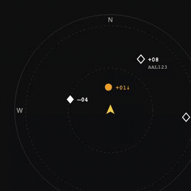
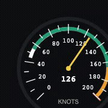
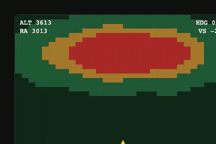
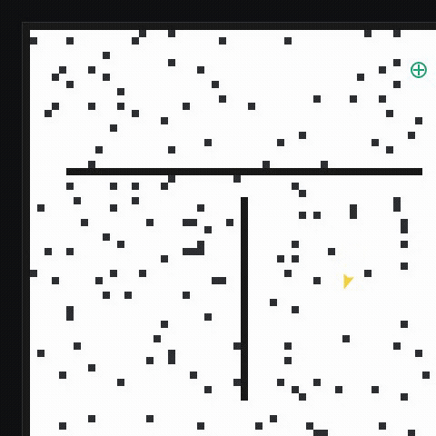
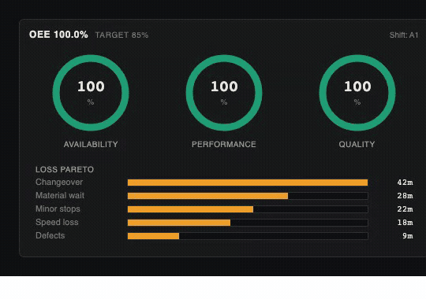
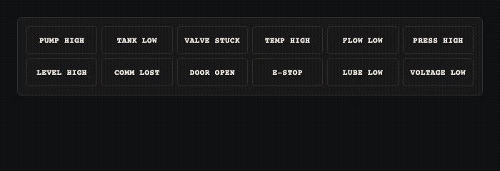

# Altara

**React components for real-time telemetry dashboards.** Built for robotics, aerospace, and industrial IoT — embed canvas-rendered instruments, time-series, live maps, and flight displays directly into any React app.

<video src="https://raw.githubusercontent.com/JayaSaiKishanChapparam/altara/main/docs/assets/video/drone-gcs-hero.mp4" poster="https://raw.githubusercontent.com/JayaSaiKishanChapparam/altara/main/docs/assets/video/drone-gcs-hero.png" width="900" muted autoplay loop playsinline></video>

<sub>A drone ground station built from <code>core</code> + <code>aerospace</code>. Video not playing? <a href="https://raw.githubusercontent.com/JayaSaiKishanChapparam/altara/main/docs/assets/drone-gcs-hero.gif">Watch the GIF</a>.</sub>

**[Website](https://www.usealtara.dev/) · [Live demo](https://jayasaikishanchapparam.github.io/altara/demo/) · [Storybook](https://jayasaikishanchapparam.github.io/altara/storybook/)**

[](https://npmjs.com/package/@altara/core)
[](https://npmjs.com/package/@altara/aerospace)
[](https://npmjs.com/package/@altara/av)
[](https://npmjs.com/package/@altara/industrial)
[](https://npmjs.com/package/@altara/ros)
[](https://npmjs.com/package/@altara/mqtt)
[](https://bundlephobia.com/package/@altara/core)
[](https://github.com/JayaSaiKishanChapparam/altara/actions)
[](LICENSE)

## Packages

| Package | Description |
| --- | --- |
| [`@altara/core`](packages/core) | Components, hooks, MQTT/mock adapters, design tokens. The starting point. |
| [`@altara/aerospace`](packages/aerospace) | Flight instruments — PFD, HSI, altimeter, airspeed, VSI, engine cluster, TCAS, TAWS, FMA, fuel gauge, radio altimeter. |
| [`@altara/av`](packages/av) | Autonomous-vehicle UI — LiDAR (Three.js), occupancy grid, object detection, path planner, perception state machine, SLAM, radar, control trace. |
| [`@altara/industrial`](packages/industrial) | SCADA / HMI — waterfall spectrogram (FFT), OEE dashboard, PID tuning, alarm annunciator, trend recorder, P&ID symbols, process flow, motor dashboard, predictive-maintenance gauge. |
| [`@altara/ros`](packages/ros) | rosbridge adapter + typed factories for common `sensor_msgs/*` message types. |
| [`@altara/mqtt`](packages/mqtt) | MQTT-over-WebSocket adapter (re-exports `createMqttAdapter` from core). |

## Install

```bash
# Start with core — required for every package below.
npm install @altara/core

# Add the extras you need:
npm install @altara/aerospace        # flight instruments
npm install @altara/av three         # autonomous-vehicle UI (three is an optional peer dep)
npm install @altara/industrial       # SCADA / HMI / industrial-IoT
npm install @altara/ros              # ROS2 / rosbridge
npm install @altara/mqtt mqtt        # MQTT brokers (mqtt is an optional peer dep)
```

## Quick start

```tsx
import '@altara/core/styles.css';
import { AltaraProvider, TimeSeries, Gauge } from '@altara/core';
import { PrimaryFlightDisplay } from '@altara/aerospace';

export function Dashboard() {
  return (
    <AltaraProvider theme="dark">
      <PrimaryFlightDisplay mockMode size="md" />
      <TimeSeries mockMode height={240} />
      <Gauge mockMode min={0} max={100} label="Battery" unit="%" />
    </AltaraProvider>
  );
}
```

`mockMode` plumbs realistic synthetic data into every component until you swap in a real `dataSource`.

## Next.js / SSR

Every published bundle ships with the `"use client"` directive, so you can import
Altara directly from a **Next.js App Router** server component file without
wrapping each import yourself:

```tsx
// app/page.tsx — no 'use client' needed here
import { AltaraProvider, Gauge } from '@altara/core';

export default function Page() {
  return (
    <AltaraProvider theme="dark">
      <Gauge mockMode min={0} max={100} label="Battery" unit="%" />
    </AltaraProvider>
  );
}
```

What that does and doesn't cover:

- **Components are client-side.** They render to Canvas/SVG and drive off
  `requestAnimationFrame`, so they mount and paint in the browser. There is no
  server-rendered fallback image — expect an empty box in the initial HTML.
- **No module-scope browser access.** Nothing touches `window`, `document`, or
  `navigator` at import time, so bundling and RSC analysis in a Node environment
  are safe. All DOM access lives inside effects.
- **Pages Router / Vite / CRA** need no directive and are unaffected by it.
- **Optional peer deps** (`leaflet`, `react-leaflet`, `react-grid-layout`,
  `three`, `mqtt`) are dynamically imported at runtime, so they are never pulled
  into a server bundle.

## What's included

### `@altara/core` — telemetry primitives

| Component | What it does |
| --- | --- |
| `TimeSeries` | Canvas-rendered time-series chart — `requestAnimationFrame` + `RingBuffer` for smooth 60+ fps. |
| `Gauge` | SVG analog gauge with 270° sweep, animated needle, and threshold-zone arcs. |
| `Attitude` | Canvas artificial horizon — sky/ground halves, pitch ladder, fixed aircraft symbol. |
| `SignalPanel` | Compact grid of named telemetry values with status dots, threshold coloring, staleness. |
| `LiveMap` | GPS track on Leaflet (optional peer dep) with heading marker and geofence overlays. |
| `EventLog` | Scrollable severity-tagged log with filter, auto-scroll-when-pinned, and `maxEntries` cap. |
| `ConnectionBar` | Persistent status strip — connection state, URL, latency, message rate. |
| `MultiAxisPlot` | Dual-Y-axis time-series chart. |
| `DashboardLayout` | `react-grid-layout` integration for draggable / resizable panels. |

Plus `createWorkerDataSource` (moves ingest, ring buffering, **and** min/max decimation off the main thread — see [below](#the-worker-pipeline)), `createMqttAdapter`, and `createMockDataSource` for synthetic feeds.

### `@altara/aerospace` — flight instruments

<table>
<tr>
<td align="center" colspan="2">
<video src="https://raw.githubusercontent.com/JayaSaiKishanChapparam/altara/main/docs/assets/video/aerospace-pfd-fd.mp4" poster="https://raw.githubusercontent.com/JayaSaiKishanChapparam/altara/main/docs/assets/video/aerospace-pfd-fd.png" width="520" muted autoplay loop playsinline title="Primary Flight Display with flight director"></video><br/><sub><a href="https://raw.githubusercontent.com/JayaSaiKishanChapparam/altara/main/apps/storybook/public/gifs/aerospace-pfd-fd.gif">GIF fallback</a></sub><br/>
<sub><b>PrimaryFlightDisplay</b> — composite PFD with attitude, tapes, VSI, and flight director</sub>
</td>
</tr>
<tr>
<td align="center">
<video src="https://raw.githubusercontent.com/JayaSaiKishanChapparam/altara/main/docs/assets/video/aerospace-hsi.mp4" poster="https://raw.githubusercontent.com/JayaSaiKishanChapparam/altara/main/docs/assets/video/aerospace-hsi.png" width="240" muted autoplay loop playsinline title="Horizontal Situation Indicator"></video><br/><sub><a href="https://raw.githubusercontent.com/JayaSaiKishanChapparam/altara/main/apps/storybook/public/gifs/aerospace-hsi.gif">GIF fallback</a></sub><br/>
<sub><b>HorizontalSituationIndicator</b></sub>
</td>
<td align="center">
<br/>
<sub><b>TCASDisplay</b></sub>
</td>
</tr>
<tr>
<td align="center">
<br/>
<sub><b>AirspeedIndicator</b></sub>
</td>
<td align="center">
<br/>
<sub><b>TerrainAwareness</b></sub>
</td>
</tr>
</table>

11 components total: `PrimaryFlightDisplay` · `HorizontalSituationIndicator` · `Altimeter` · `VerticalSpeedIndicator` · `AirspeedIndicator` · `EngineInstrumentCluster` · `RadioAltimeter` · `TerrainAwareness` · `TCASDisplay` · `AutopilotModeAnnunciator` · `FuelGauge`. All canvas/SVG, all support `mockMode`, all consume any `AltaraDataSource`.

### `@altara/av` — autonomous-vehicle UI

```tsx
import { LiDARPointCloud, OccupancyGrid, ControlTrace } from '@altara/av';

<LiDARPointCloud mockMode width={800} height={500} />
<OccupancyGrid mockMode width={400} height={400} />
<ControlTrace mockMode windowMs={15_000} />
```

11 components total: `LiDARPointCloud` (Three.js, lazy-imported as an optional peer dep) · `OccupancyGrid` · `ObjectDetectionOverlay` · `PathPlannerOverlay` · `VelocityVectorDisplay` · `PerceptionStateMachine` · `SensorHealthMatrix` · `CameraFeed` · `ControlTrace` · `RadarSweep` · `SLAMMap`.

<table>
<tr>
<td align="center" colspan="2">
<video src="https://raw.githubusercontent.com/JayaSaiKishanChapparam/altara/main/docs/assets/video/av-lidar.mp4" poster="https://raw.githubusercontent.com/JayaSaiKishanChapparam/altara/main/docs/assets/video/av-lidar.png" width="520" muted autoplay loop playsinline title="LiDAR point cloud — Three.js"></video><br/><sub><a href="https://raw.githubusercontent.com/JayaSaiKishanChapparam/altara/main/apps/storybook/public/gifs/av-lidar.gif">GIF fallback</a></sub><br/>
<sub><b>LiDARPointCloud</b> — Three.js point cloud, color by intensity</sub>
</td>
</tr>
<tr>
<td align="center">
<br/>
<sub><b>OccupancyGrid</b></sub>
</td>
<td align="center">
<video src="https://raw.githubusercontent.com/JayaSaiKishanChapparam/altara/main/docs/assets/video/av-radar.mp4" poster="https://raw.githubusercontent.com/JayaSaiKishanChapparam/altara/main/docs/assets/video/av-radar.png" width="240" muted autoplay loop playsinline title="Radar sweep"></video><br/><sub><a href="https://raw.githubusercontent.com/JayaSaiKishanChapparam/altara/main/apps/storybook/public/gifs/av-radar.gif">GIF fallback</a></sub><br/>
<sub><b>RadarSweep</b></sub>
</td>
</tr>
</table>

### `@altara/industrial` — SCADA / HMI / industrial-IoT

```tsx
import { WaterfallSpectrogram, OEEDashboard, AlarmAnnunciatorPanel } from '@altara/industrial';

<WaterfallSpectrogram mockMode width={720} height={360} />
<OEEDashboard mockMode shift="A1" />
<AlarmAnnunciatorPanel mockMode columns={6} />
```

9 components total: `WaterfallSpectrogram` (FFT + Canvas, flagship) · `OEEDashboard` · `AlarmAnnunciatorPanel` · `TrendRecorder` · `PIDTuningPanel` · `PIDNode` (ISA 5.1 symbol) · `ProcessFlowDiagram` · `MotorDashboard` · `PredictiveMaintenanceGauge`.

<table>
<tr>
<td align="center" colspan="2">
<video src="https://raw.githubusercontent.com/JayaSaiKishanChapparam/altara/main/docs/assets/video/industrial-spectrogram.mp4" poster="https://raw.githubusercontent.com/JayaSaiKishanChapparam/altara/main/docs/assets/video/industrial-spectrogram.png" width="640" muted autoplay loop playsinline title="Waterfall spectrogram — FFT"></video><br/><sub><a href="https://raw.githubusercontent.com/JayaSaiKishanChapparam/altara/main/apps/storybook/public/gifs/industrial-spectrogram.gif">GIF fallback</a></sub><br/>
<sub><b>WaterfallSpectrogram</b> — Hann + radix-2 FFT, dB color map</sub>
</td>
</tr>
<tr>
<td align="center">
<br/>
<sub><b>OEEDashboard</b></sub>
</td>
<td align="center">
<br/>
<sub><b>AlarmAnnunciatorPanel</b></sub>
</td>
</tr>
</table>

### `@altara/ros` — ROS2 / rosbridge

```tsx
import { createRosbridgeAdapter } from '@altara/ros';

const source = createRosbridgeAdapter({
  url: 'ws://localhost:9090',
  topic: '/imu/data',
  messageType: 'sensor_msgs/Imu',
  valueExtractor: (msg) => msg.angular_velocity.z,
});
```

For multi-input instruments, pass a `channels` map (or use `createImuAdapter` for `roll`/`pitch`/`yaw` off one socket) to fan a single message out into named channels, then `mergeChannels` them into one `dataSource` to wire up a `PrimaryFlightDisplay`.

Pair with `rosbridge_suite` running on the robot or in Docker (`docker compose -f docker/ros2/docker-compose.yml up`).

### `@altara/mqtt` — MQTT brokers

```tsx
import { createMqttAdapter } from '@altara/mqtt';

const source = createMqttAdapter({
  url: 'ws://broker.local:8083/mqtt',
  topic: 'sensors/temp/room1',
  valueExtractor: (payload) => (payload as { celsius: number }).celsius,
});
```

JSON / string / binary payload decoding, MQTT topic wildcards (`+`, `#`).

## Why Altara

Grafana and Foxglove are **applications**; Altara and Recharts are **libraries you
compile into your own app**. That is the real axis — most of the table follows
from it.

| | Altara | Grafana | Foxglove | Recharts |
| --- | --- | --- | --- | --- |
| Shape | React library | Server + web app | Desktop / web app | React library |
| Embeds in React app | ✅ Native | ❌ Iframe embed | ❌ Separate app | ✅ Native |
| Renders to | Canvas + rAF for charts; SVG for gauges/indicators | Canvas (uPlot) | Canvas / WebGL | SVG |
| Aerospace instruments | ✅ Full suite (PFD/HSI/TCAS…) | ❌ | ⚠️ Generic gauges/indicators, no flight instruments | ❌ |
| AV / LiDAR / perception | ✅ Native (Three.js) | ❌ | ✅ Native | ❌ |
| Industrial / SCADA / HMI | ✅ Native (FFT, OEE, P&ID, alarms) | ⚠️ Plugin | ❌ | ❌ |
| ROS2 adapter | ✅ Native | ⚠️ Plugin | ✅ Native | ❌ |
| MQTT adapter | ✅ Native | ⚠️ Plugin | ❌ | ❌ |
| Alerting, auth, RBAC | ❌ Your app's job | ✅ Built in | ✅ Built in | ❌ |
| Usable without writing code | ❌ You build the UI | ✅ Point at a datasource | ✅ Open a file / connect | ❌ |
| Recording + replay of sessions | ❌ Not in the library | ⚠️ Via stored backend | ✅ MCAP/ROS bag, native | ❌ |
| Historical / stored data | ❌ Live sources only | ✅ Core capability | ✅ Log files | ❌ |
| 3D scene graph & point clouds | ⚠️ Three.js panels in `av` | ❌ | ✅ Deeper and more mature | ❌ |
| Plugin / integration ecosystem | ❌ None | ✅ Large | ⚠️ Extensions | ❌ |
| Bundle size | 14.4 KB gz (core) | n/a — separate app | n/a — separate app | 147.9 KB gz |
| License | MIT | AGPL-3.0 | Proprietary | MIT |

<sub>Rendering is <b>not</b> a differentiator against Grafana — its Time series
panel renders to canvas via uPlot, same as Altara. The difference is
architectural: Altara's render loop runs inside your app on data you already
have, with no server or query round-trip. If you want a dashboard without
writing a React app, or you need recording, stored history, or a mature 3D
viewer, Grafana and Foxglove are the better tools and the rows above say so.
Altara core measured 2026-09-30 (<code>@altara/core@0.2.3</code>, <code>size-limit</code>);
<code>recharts@3.10.1</code> via bundlephobia 2026-08-18.</sub>

### The rendering claim, measured


Per-frame main-thread work as the number of live widgets grows, on a 2019
Intel i9-9880H (16 cores) in headed Chromium 147 at 1440×900. All three paths
draw the identical picture from the identical math, so rendering technology is
the only variable. At 200 widgets: **Canvas 1.13 ms, imperative SVG 5.18 ms,
React-driven SVG 10.28 ms** per frame.

Numbers are hardware-specific and the harness says so. Run it yourself, read
the method and its caveats, or read the raw results:
**[`scripts/bench/`](scripts/bench/)** ·
[results-3way-highN.json](scripts/bench/results-3way-highN.json) ·
[results-3way-cpu6x.json](scripts/bench/results-3way-cpu6x.json) (CPU throttled 6×) ·
[results-alloc-baseline.json](scripts/bench/results-alloc-baseline.json) ([figure](docs/assets/ringbuffer-alloc.png))

## The worker pipeline

For feeds fast enough that the render loop becomes the bottleneck,
`createWorkerDataSource` moves the whole pre-paint stage off the main thread. The
worker owns the WebSocket, a `RingBuffer` per channel, and the min/max reduction;
the renderer receives per-column min/max in data space plus each channel's extent
and does nothing but project and stroke.

The protocol is push, not request/response. The visible window is wall-clock
anchored, so it advances by itself every frame — the renderer sends a viewport
only when plot width, window length, or the channel list actually changes, and
the worker derives the rest. Frames carry an epoch so geometry decimated for a
superseded viewport is never drawn, and the worker keeps at most one
unacknowledged frame in flight, skipping flushes rather than queueing them when
the main thread stalls. Frames are whole snapshots, never deltas, so a dropped
one is always safe.

Charts feature-detect the capability, so this is opt-in and additive: mock,
replay, rosbridge, and MQTT sources are untouched and decimate locally exactly as
before. Several charts can share one source — each acquires its own viewport, so
they share the socket, the ingest pass, and the ring buffers, and differ only in
the decimation pass.

Full API, caveats, and the two gotchas (`bufferSize` is ignored for decimating
sources; `mergeChannels` exposes no decimator) are in
**[`packages/core/README.md`](packages/core#off-main-thread-decimation--createworkerdatasource)**.

### What it measurably does — and what it does not

Measured on the demo's Worker Pipeline tab via
[`apps/demo/scripts/measure-worker-path.mjs`](apps/demo/scripts/measure-worker-path.mjs)
(`pnpm --filter @altara/demo measure`), which drives both paths against the same
live feed. **2026-09-30, 2019 Intel i9-9880H (16 cores), macOS 26.6, headed
Chromium via Playwright 1.59, 1600×1000.** One machine, one afternoon — not a
benchmark suite.

**Load, identical on both paths and stable across runs:**

| | |
| --- | --- |
| Inbound | ~5,000 samples/s across 7 channels, 50 messages/s |
| Behind the plot | ~49,900 samples in the visible window |
| Sent to the renderer | ~4,990 bucket columns |

That reduction is the reproducible result: **the draw pass touches ~10× fewer
points than the window holds, and with a worker-backed source it touches zero
raw samples.** It is a counted quantity, not a timing, and it did not move
between runs.

**Frame pacing, three 10-second samples per path:**

| Path | Frame interval | Worst frame | Long frames/s |
| --- | --- | --- | --- |
| Worker (decimator) | 16.7–22.3 ms | 18.6–35.2 ms | 0–5 |
| Main thread (local) | 16.7–54.4 ms | 17.6–67.4 ms | 0–16 |

**No speed multiplier is claimed from this.** The ranges overlap, and a second
run of the same script narrowed the gap further (16.7–29.4 vs 16.7–35.1 ms). Both
paths reach the same 16.7 ms floor; what differs is the tail, and run-to-run
variance on this machine is large enough that even the tail difference is not
something to put a number on. If you need a figure for your own workload, run the
script on your hardware.

The defensible claim is the structural one: per frame, per channel, the local
path copies the ring buffer, scans it for the extent, and reduces it to columns —
three O(samples) passes on the render thread. The worker path does that work
elsewhere and leaves the renderer O(columns). Whether that shows up as smoother
frames depends on how much else is competing for the thread.

## Stability

**Pre-1.0.** Every package is below `1.0.0`, and until one reaches it the public
API is not considered stable:

- **Patch** (`0.2.1` -> `0.2.2`) — bug fixes, docs, packaging. Safe.
- **Minor** (`0.2.x` -> `0.3.0`) — new features, and **may include breaking
  changes**. This is the pre-1.0 semver allowance, not an accident. Pin the
  minor (`~0.2.0`) if you need that not to happen.
- Breaking changes are always described in the package's
  per-package CHANGELOG; anything spanning packages also lands in
  [MIGRATION.md](MIGRATION.md).

In practice the component APIs have been stable since `0.1.0` and every break so
far has been in the adapter layer. That is a track record, not a guarantee.

## Documentation

- **[📚 Storybook](https://jayasaikishanchapparam.github.io/altara/storybook/)** — every component, every prop, with live demos. Plus Guides, the Cookbook, and Comparisons vs. Grafana / Foxglove.
- **[🛰️ Live demo dashboard](https://jayasaikishanchapparam.github.io/altara/demo/)** — multi-tab showcase combining `core`, `aerospace`, `av`, and `industrial`. Most tabs run on in-browser generators; the Worker Pipeline tab drives a real WebSocket and needs a local telemetry server, so it is inert on the hosted build.

Or run them locally:

```bash
git clone https://github.com/JayaSaiKishanChapparam/altara.git
cd altara
pnpm install
pnpm --filter @altara/storybook storybook   # http://localhost:6006
pnpm --filter @altara/demo dev              # http://localhost:5173
```

You'll find a landing page, a six-part **Guides** section (Getting started, Connecting ROS2, Connecting MQTT, Mock data, Theming, Performance), five full **Cookbook** dashboards (drone, robot arm, IoT sensor grid, drone ground station, AV stack), two honest **Comparisons** vs. Grafana / Foxglove, and an interactive playground for every component across `core`, `aerospace`, `av`, and `industrial`.

## Development

Common commands. See [CONTRIBUTING.md](./CONTRIBUTING.md) for the full repository layout and contributor checklist.

| Command | What it does |
| --- | --- |
| `pnpm install` | Install all workspace deps |
| `pnpm turbo build` | Build every package + Storybook |
| `pnpm turbo test` | Run unit tests across the workspace |
| `pnpm turbo lint` | ESLint everywhere |
| `pnpm --filter @altara/storybook storybook` | Storybook on http://localhost:6006 |
| `pnpm --filter @altara/demo dev` | Live demo dashboard on http://localhost:5173 (serves the synthetic telemetry feed too) |
| `pnpm --filter @altara/demo measure` | Drive both decimation paths in a real browser and print the spread |
| `pnpm --filter @altara/core dev` | Watch + rebuild `@altara/core` |
| `pnpm changeset` | Add a release note for a PR |
| `STORY_FILTER=<substring> node scripts/record-gifs.js` | Record demo GIFs (Storybook must be running; `ffmpeg` required) |

Releases are automated. Merging a PR with a changeset to `main` opens a "Version Packages" PR; merging that triggers `npm publish` for every public package with a pending bump.

## Repository layout

```
packages/
  core/        @altara/core
  aerospace/   @altara/aerospace
  av/          @altara/av
  industrial/  @altara/industrial
  ros/         @altara/ros
  mqtt/        @altara/mqtt
apps/
  storybook/   @altara/storybook — interactive docs (deployed to GH Pages)
  demo/        @altara/demo — live multi-package dashboard (deployed to GH Pages)
               scripts/ — synthetic telemetry server + worker-path measurement
docker/ros2/   rosbridge dev environment
scripts/       GIF recorder, smoke tests, JSDoc check, canvas-vs-SVG bench
docs/          cross-cutting docs (accessibility, etc.)
.changeset/    pending version bumps
```

## Links

- **[Storybook](https://jayasaikishanchapparam.github.io/altara/storybook/)** · **[Live demo](https://jayasaikishanchapparam.github.io/altara/demo/)**
- **npm** — [`@altara/core`](https://npmjs.com/package/@altara/core) · [`@altara/aerospace`](https://npmjs.com/package/@altara/aerospace) · [`@altara/av`](https://npmjs.com/package/@altara/av) · [`@altara/industrial`](https://npmjs.com/package/@altara/industrial) · [`@altara/ros`](https://npmjs.com/package/@altara/ros) · [`@altara/mqtt`](https://npmjs.com/package/@altara/mqtt)
- **[GitHub Discussions](https://github.com/JayaSaiKishanChapparam/altara/discussions)** — questions, ideas, what-are-you-building threads
- **[CONTRIBUTING](./CONTRIBUTING.md)** — dev setup, PR checklist, story / guide patterns

## License

MIT. See [LICENSE](LICENSE).
